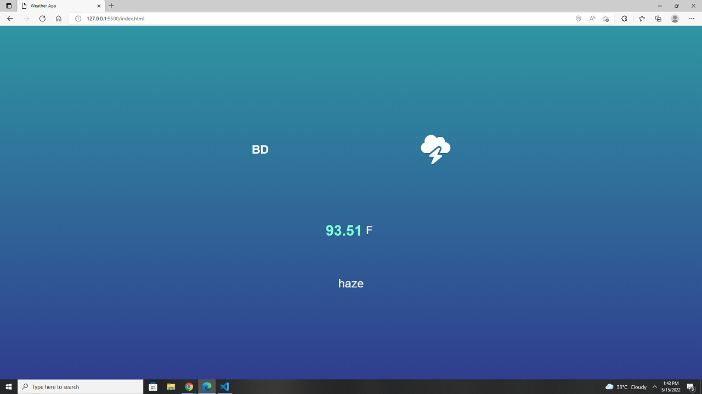

# Weather App using Api And VanillaJs    
    
  

 

I used Html,Css, Vanilla js, Api to build this project.
 
API Link - https://api.openweathermap.org/data/2.5/weather?lat={lat}&lon={lon}&appid={API key}

### Author Links  

👋 Hello,I am Shadman and I am a Full Stack Web developer  

🚀 Follow me:  

  - [Github](https://github.com/sakibshadman19)
  - [LinkedIn](https://www.linkedin.com/in/shadman-sakib-95462923a/)
  - [Facebook](https://www.facebook.com/shadman.sakibtanmoy)
  

<!-- all link is here -->

